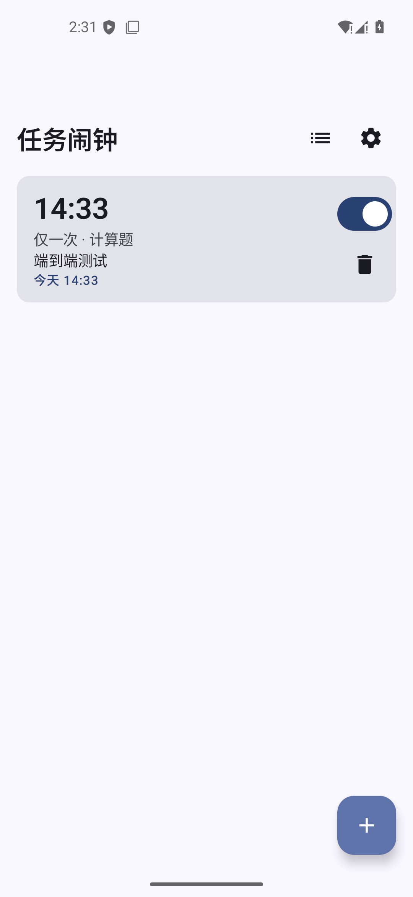
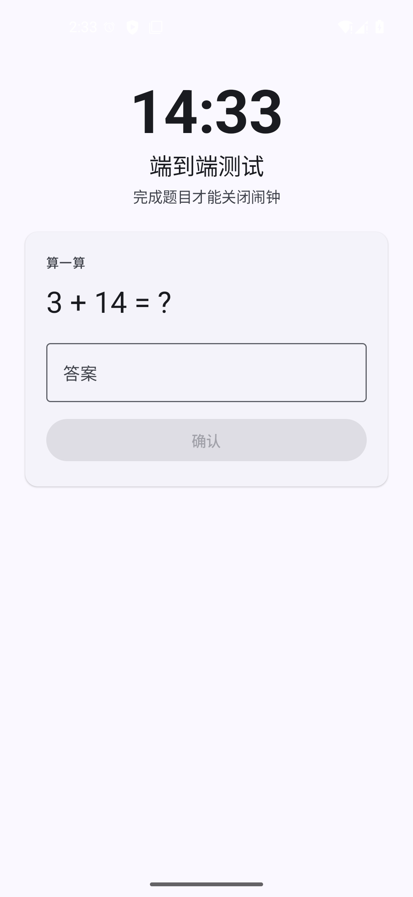
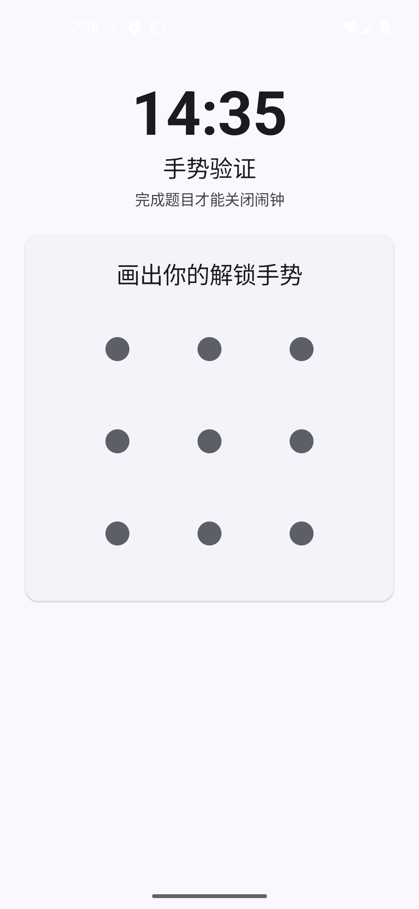
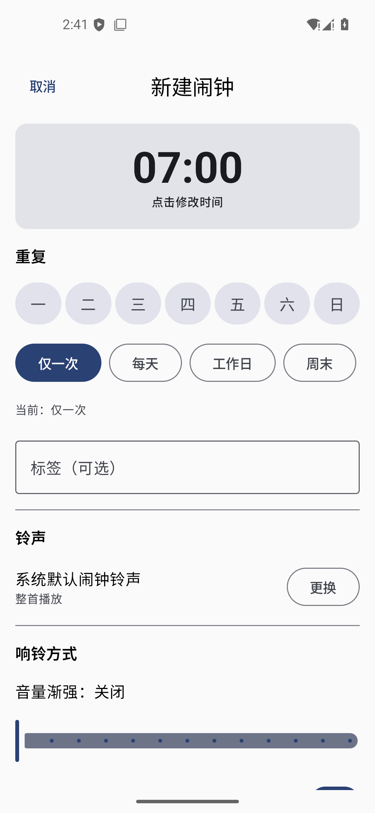
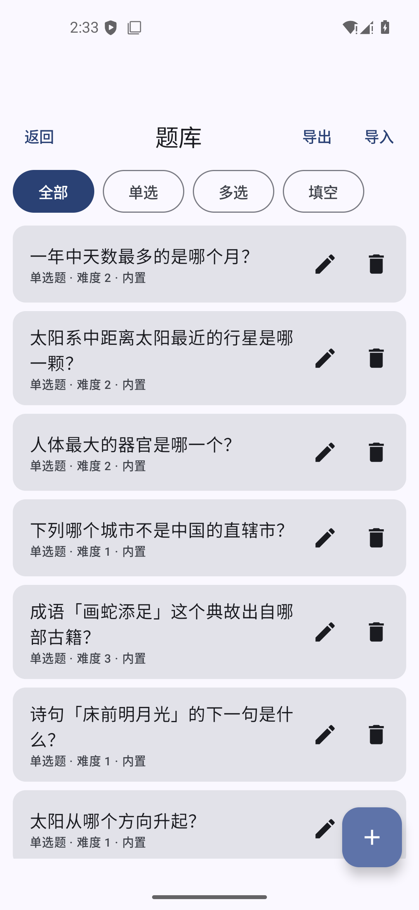

# 任务闹钟（AppAlarm）

一个轻量的 Android 任务解锁闹钟：**闹钟响了必须做对题才能关掉**，用来对付「迷迷糊糊按掉闹钟继续睡」。

- Kotlin + Jetpack Compose + Material 3
- 无网络、无账号、无广告、无统计
- minSdk 26 / targetSdk 37，包名 `com.appalarm`
- Release APK（R8 压缩后）约 **1.3 MB**

## 截图

| 闹钟列表 | 响铃答题 · 计算题 | 响铃答题 · 手势 |
|---|---|---|
|  |  |  |

| 闹钟编辑 | 题库管理 | |
|---|---|---|
|  |  | |

## 三个核心功能

### 1. 任务解锁

关闭闹钟前必须完成题目，支持五类题型：

| 题型 | 说明 |
|---|---|
| 单选题 | 从题库抽题，选项和答案在题库里维护 |
| 多选题 | 少选、多选都算错 |
| 填空题 | 支持多个等价答案（如「12」和「十二」） |
| 计算题 | **运行时随机生成**，背不下来；难度 1~3 |
| 手势解锁 | 3×3 九宫格图案，自己录制 |

内置 48 道中文题目（单选 16 / 多选 12 / 填空 20），可以增删改，也可以导出成 JSON 用文本编辑器批量整理后再导回来。

**一条硬性规则**：任何异常情况（题库为空、指定题目被删、手势没录或损坏）都会自动回退到随机计算题。
闹钟可以难，但绝不能不让你关掉。

### 2. 重复规则

按一周任意星期几重复（位掩码，bit0=周一 … bit6=周日），另有「仅一次 / 每天 / 工作日 / 周末」快捷预设。
一次性的闹钟响过之后会自动停用。

调度用 `AlarmManager.setAlarmClock()`——这是唯一能穿透 Doze、并且会在状态栏显示闹钟图标的方式。
响铃时**先把下一次排好再开始响**，因为响铃会拉起前台服务和全屏界面，进程随时可能被回收；
顺序反过来的话，一旦在这中间被杀，明天的闹钟就永远丢了。

### 3. 铃声与截取

三种来源：系统闹钟铃声 / 本机媒体库音频（`MediaStore`）/ 用 SAF 选任意音频文件（不需要权限，但会持久化 URI 授权）。

**「截取片段」的实现是记录起止毫秒、播放时只循环这一段，不做音频转码。**
好处是不需要任何编解码库、不占额外存储、改起止点是瞬时的；代价是这段片段只在本应用内有效，
不会生成一个能被系统铃声设置选中的新文件。另外支持音量渐强和震动。

## 快速开始

```bash
git clone https://github.com/<你的用户名>/task-alarm.git
cd task-alarm
./gradlew assembleDebug        # → app/build/outputs/apk/debug/app-debug.apk
./gradlew testDebugUnitTest    # 117 个 JVM 单元测试
./gradlew assembleRelease      # R8 压缩，约 1.3 MB
```

在 Android Studio 里直接 `File → Open` 打开项目目录也可以。

需要 **JDK 25**（AGP 9.4 的要求）。Android Studio 自带的 JBR 就是 OpenJDK 25，命令行构建把 `JAVA_HOME` 指向它即可；
只要 Gradle 本身跑在 JDK 25 上，工具链要求就自动满足，**不需要**在 `gradle.properties` 里额外配置。

> 断点调试请用 Android Studio 自带的调试器，不要用 `jdb` —— 原因见文末「调试」一节。

> 仓库里还有一套 `tools/*.ps1`，那是开发这个项目时为了在**受限文件沙箱**里构建而写的（把 Gradle/Android 的用户目录重定向进项目）。
> 普通开发环境**不需要**它们，直接 `./gradlew` 就好。保留它们是因为里面记录的坑值得留档，见下面的附录。

## 附录：本机沙箱构建（普通环境可跳过）

```powershell
tools/build.ps1                    # assembleDebug
tools/build.ps1 assembleRelease    # R8 压缩后的 release 包
tools/build.ps1 compileDebugKotlin # 只编译，快速查错
```

### 为什么需要这个脚本

本机 DSH 文件沙箱只允许写工作区内，而 Gradle、AGP 和 Android 工具都想往用户目录写。
脚本（`tools/gradle-env.ps1`）把这些全部重定向进项目：

| 变量 | 指向 | 原因 |
|---|---|---|
| `GRADLE_USER_HOME` | `.gradle-home/` | Gradle 缓存、守护进程 |
| `ANDROID_USER_HOME` | `.android-home/` | 调试密钥库、analytics |
| `ANDROID_PREFS_ROOT` / `ANDROID_EMULATOR_HOME` | `.android-home/` | 模拟器偏好 |
| `ANDROID_AVD_HOME` | `.android-home/avd/` | AVD 与磁盘镜像 |

另外两个坑（脚本里都有注释）：

1. **AGP 9.4 需要 Java 25 工具链。** Android Studio 自带的 JBR 就是 OpenJDK 25，但 Gradle 不会扫描那个目录，
   于是会去 foojay 下载（本机实测约 20 KB/s，要跑几小时）。`gradle.properties` 里指定了 JBR 路径并禁用自动下载。
2. **不要用 `$home` 当变量名。** PowerShell 的 `$HOME` 是只读的，赋值会失败但**保留旧值**，
   结果 `ANDROID_AVD_HOME` 被静默指到 `C:\Users\<user>\avd`，模拟器报「找不到 AVD」。

## 测试

```powershell
tools/test.ps1     # 117 个 JVM 单元测试
```

覆盖：下次响铃时间计算（含跨天、夏令时跳变）、判题宽严、九宫格手势、计算题生成与自洽性、
题库校验与 JSON 编解码（含 BOM、未知字段、高版本拒绝）、内置题库的完整性回归。

> 为什么不用 `gradle testDebugUnitTest`：沙箱禁止 Gradle 给它 fork 出来的测试 JVM 写 stdin，
> 会以 "Could not write standard input to Gradle Test Executor" 失败。所以脚本拆成两步：
> 用 Gradle 编译（这步正常），再用前台 JUnit 直接跑（pwsh 能正常捕获它的输出）。
> `testDebugUnitTest` 任务本身仍然配置在 `app/build.gradle.kts` 里，在普通终端或 Android Studio 中可用。

## 模拟器

```powershell
tools/emulator.ps1                 # 无窗口启动（作为后台任务运行）
tools/emulator.ps1 -WithWindow     # 显示窗口
```

AVD 是手写的（本机没有 `avdmanager`），配置文件在 `.android-home/avd/`。

> 模拟器在受限沙箱下会**静默退出**：它需要宿主 IPC（GPU 传输和调制解调器模拟用的命名管道/共享内存）。
> 必须在不受限的沙箱模式下启动。

## 代码结构

```
com/appalarm/
  core/                纯逻辑，不依赖 Android，全部可单测
    NextTriggerCalculator   下次响铃时刻（跨天 / 夏令时）
    NextTriggerLabel        把下次响铃写成人话（「明天 07:00」）
    RingTask / RingTaskFactory  出题与「无解题兜底」
    ArithmeticGenerator 随机计算题
    AnswerChecker       判题（输入宽容、语义严格）
    GesturePattern      九宫格编解码 / 命中 / 比对
    QuestionBankValidator   导入题库校验
  data/
    model/              Alarm / Question / AppSettings / Weekdays
    AppJson            全应用统一 JSON 配置
    JsonStore          JSON 文件当数据库（临时文件 + 改名，剥 BOM）
    QuestionBankCodec  题库导入导出（不依赖 Context，可单测）
    AppRepository      唯一数据入口，Compose 可观察
    BuiltInQuestions   48 道内置题
  alarm/               调度与响铃链路
    AlarmScheduler     setAlarmClock / 取消 / 全量重排
    AlarmReceiver      到点触发：先排下一次，再响
    RescheduleReceiver 开机 / 改时间 / 换时区后重排
    RingService        前台服务：播音、音量渐强、震动、唤醒锁
    RingNotifier       通知频道 + 全屏 Intent
    RingActivity       锁屏全屏答题界面（singleInstance）
  ui/                  Compose 界面
    AppRoot            5 个界面的极简返回栈（不引 Navigation Compose）
    home/ edit/ bank/ settings/ ring/ ringtone/ components/
```

## 已知限制

- **无法阻止强行关闭。** 用户仍然可以从系统设置强行停止应用或重启手机。这是 Android 的设计，
  任何闹钟应用都绕不过去。本应用不做激进对抗，以免变得不可靠。
- **全屏通知权限。** Android 14+ 默认不授予 `USE_FULL_SCREEN_INTENT`，缺了它响铃只能是一条普通通知。
  主页和设置页会显式提示并提供跳转。（实测：直接 `startActivity` 会被系统以 `BAL_BLOCK` 拦下，
  真正生效的是全屏 Intent 通知那条路——所以两条路都留着了。）
- **铃声片段只在本应用内有效**，见上文。
- **响铃时答题界面的返回键被拦截**，但 Home 键和强行停止拦不住。
- **亮屏时答题界面不会自动弹出。** 系统的全屏通知只在**锁屏或息屏**时才会被自动拉起；
  亮屏时闹钟照样会响、也会弹悬浮通知，但界面要点一下通知才出现。这是 Android 对后台启动
  Activity 的限制（实测日志：`Background activity launch blocked! ... autoPull`），
  直接 `startActivity` 和用 PendingIntent `send()` 两条路都会被拦。
- **国产 ROM 的后台管控。** 华为 / 小米 / OPPO / vivo 在「从最近任务划掉」或长时间息屏后会
  直接强行停止应用，而**应用一旦被强行停止，系统就会取消它的全部闹钟**。表现就是「闹钟根本不响」
  或「只有挂在后台才有用」。必须手动放行自启动 / 关联启动 / 后台活动，并把省电策略设为无限制。
  这是本应用在真机上最常见的失效原因，且模拟器完全测不出来。

### 实测过的响铃路径

在 Android 15 / API 35 模拟器、targetSdk 37 上验证：

| 场景 | 结果 |
|---|---|
| 应用在前台 | ✅ 答题界面正常 |
| 应用在后台（进程存活）+ 锁屏 | ✅ 答题界面正常 |
| **进程被杀（`am kill`，等价于从最近任务划掉）+ 锁屏** | ✅ **进程被广播唤醒，服务进入前台，系统拉起答题界面** |
| 进程被杀 + **亮屏** | ⚠️ 闹钟响、通知弹出，但界面需手动点开 |
| 强行停止（设置里 Force stop） | ❌ 系统取消全部闹钟，**这是 Android 的设计，无法绕过** |

## 调试

日常运行时取证用 adb 就够了 —— 本项目那几个真实 bug（BOM 导致导入失败、手势丢首点、
后台启动被 `BAL_BLOCK` 拦截）都是这样查出来的：

| 想知道 | 命令 |
|---|---|
| 闹钟真注册了吗？是 `setAlarmClock` 吗？ | `adb shell dumpsys alarm \| grep com.appalarm` |
| 前台服务在跑吗？ | `adb shell dumpsys activity services com.appalarm` |
| 持久化状态对不对？ | `adb shell run-as com.appalarm cat files/alarms.json` |
| 界面为什么没起来？ | `adb logcat`（会给出 `BAL_BLOCK` 这类系统拦截原因） |

**断点调试请用 Android Studio 自带的调试器，不要用 `jdb`。** 实测结论（Android 15 / API 35
模拟器、debug 包、`adb forward tcp:8700 jdwp:<pid>`）：

- attach 本身能成功：`jdb -connect com.sun.jdi.SocketAttach:hostname=localhost,port=8700`
  可以连上，`classes` 能看到全部 `com.appalarm.*` 类已加载；
- `suspend` 也生效（回 `All threads suspended.`）；
- 但**断点永远不会命中**：设好断点后 `cont` 回 `Nothing suspended.` —— 因为 attach 时 VM
  从未在 **VM 级别**被挂起，jdb 的事件泵不会投递断点事件。用一个「每次重组都会被读取」的
  getter（`AppRepository.getAlarms`）复现 3 次，结果完全一致；
- 另外 ART 的 JDWP attach 不稳定，会间歇性报 `handshake failed - connection prematurely closed`。

Android Studio 的调试器会正确地做 VM 级 suspend/resume 握手，所以它的断点可用。
想走「外部 agent 控制 IDE 调试器」这条路的话，`xdebug_*` 调试器工具集是
IntelliJ IDEA 2026.1.3+ 的能力（[agentic debugging](https://www.jetbrains.com/help/idea/agentic-debugging.html)）；
Android Studio 2026.1.4 的 `product-info.json` 里虽然声明了 `stdioMcpServer` 启动命令，
但它依赖的 `plugins/mcpserver/lib/mcpserver-frontend.jar` 并未随包发布，
所以目前无法把 Studio 的调试器通过 MCP 暴露出来。

## 调试小工具

`tools/Fetch.java`：基于 JVM 的 HTTP 取件工具。本机 pwsh 的 TLS 走 schannel，
会以 `SEC_E_NO_CREDENTIALS` 失败，而 JVM 自带的 JSSE 正常，所以查仓库/版本时用它。

```powershell
java tools/Fetch.java <url> [regexFilter]
```

## 许可证

[GPL-3.0](LICENSE)

你可以自由使用、修改、分发这个项目；但**如果分发了修改后的版本，必须同样以 GPL-3.0 开源并提供源码**。

## 关于签名

`release` 的签名方式由 4 个环境变量决定（见 `app/build.gradle.kts` 的 `signingConfigs`）：

| 变量 | 含义 |
|---|---|
| `APPALARM_KEYSTORE_FILE` | `.jks` 路径 |
| `APPALARM_KEYSTORE_PASSWORD` | 密钥库口令 |
| `APPALARM_KEY_ALIAS` | 别名 |
| `APPALARM_KEY_PASSWORD` | 别名口令 |

**一个都没配时会回退到调试密钥** —— 侧载没问题，但**不能上架**，而且 AGP 会在每台机器上重新生成调试密钥库，
于是不同机器（以及每一次 CI 运行）产出的 APK 签名都不同，用户无法覆盖升级、只能先卸载旧版。

先生成一个正式密钥库：

```bash
keytool -genkeypair -v -keystore release.jks -keyalg RSA -keysize 2048 \
        -validity 10000 -alias appalarm
```

**keystore 和密码绝对不要提交进仓库** —— `.gitignore` 已经挡住了 `*.jks` / `*.keystore` / `keystore.properties`。
丢了这个密钥，你就再也无法给同一个应用发布更新了。

### 自动发布

推送一个 `v*` 标签，`.github/workflows/release.yml` 会自动跑测试、构建 R8 压缩后的 release APK，
并附到 GitHub Release 上 —— 手机可以直接从 Release 页面下载安装，**不需要数据线**：

```bash
git tag -a v1.0 -m "v1.0"
git push origin v1.0
```

**首次发布前**，在 `Settings → Secrets and variables → Actions` 添加 4 个 Secret，
让 CI 用你的正式密钥签名（keystore 以 base64 存储）：

```powershell
[Convert]::ToBase64String([IO.File]::ReadAllBytes("release.jks")) | Set-Clipboard
```

| Secret 名 | 值 |
|---|---|
| `APPALARM_KEYSTORE_BASE64` | 上一步复制到的 base64 |
| `APPALARM_KEYSTORE_PASSWORD` | 密钥库口令 |
| `APPALARM_KEY_ALIAS` | 别名 |
| `APPALARM_KEY_PASSWORD` | 别名口令 |

> 没配这 4 个 Secret 时构建仍然成功，但会用**临时调试密钥**签名 —— 每次 CI 产出的 APK 签名都不同，
> 用户无法覆盖升级。所以 CI 会打一条 warning 提醒你。


